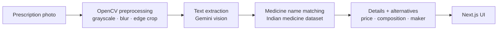

# MediSage — AI Prescription Decoder


Photograph a handwritten prescription and get back what it actually says: medicine names, price, composition, manufacturer — plus alternatives when a drug is unavailable or discontinued.

> Hackathon project, February 2025, built by a team — see [Team](#team). Prototype quality; read [Status](#status) before running it.

---

## The problem

Handwritten prescriptions are hard to read, and a misread drug name is a patient-safety issue, not an inconvenience. Pharmacies also substitute drugs without patients knowing what the substitute contains. MediSage turns a photo into structured, checkable text.

## Pipeline



1. **Preprocess** — the image is converted to grayscale, blurred, edge-detected and cropped to the prescription region before OCR (`scripts/ocr.py`).
2. **Extract** — text is read out of the cleaned image and candidate medicine names are pulled from it.
3. **Match** — names are looked up against a cleaned Indian medicine dataset of about 254,000 products (`data/indian_medicine_data_cleaned.xlsx`).
4. **Return** — the API responds with each medicine price, pack size, composition, manufacturer, description, side effects and interactions.

`models/` also contains a from-scratch handwriting recognition model (residual CNN + CTC, trained on the IAM sentences dataset), the offline alternative to a hosted vision API.

## Stack

| Layer | Technology |
| --- | --- |
| Frontend | Next.js 14, TypeScript, Tailwind CSS, shadcn/ui |
| Backend | FastAPI, Uvicorn |
| Vision / OCR | OpenCV preprocessing, Google Gemini; EasyOCR and a custom CRNN explored |
| Data | Indian medicine dataset (~254k rows), pandas + openpyxl lookup |

## Run it locally

**Prerequisites:** Python 3.11+, Node 18+, a Google Gemini API key.

```bash
git clone https://github.com/Manvendra-Pratap/MediSage
cd MediSage

# Backend
pip install -r requirements.txt
export GEMINI_API_KEY="your-key"       # see the note in Status
uvicorn main:app --reload              # http://localhost:8000/docs

# Frontend
cd frontend
npm install
npm run dev                            # http://localhost:3000
```

Try the API directly:

```bash
curl -F "file=@prescription.jpg" http://localhost:8000/upload-prescription/
```

## Status

Built in a hackathon weekend and not hardened since. Known issues, kept visible on purpose:

- **The Gemini key is hardcoded** in `scripts/ocr.py` rather than read from the environment. It should move to `GEMINI_API_KEY`, and any key that was ever committed should be revoked and rotated.
- **The frontend does not call the backend yet** — the UI and the API were built in parallel and never wired together.
- **Uploads are unvalidated.** The filename from the request is used directly to build the save path, which allows directory traversal; file type and size are not checked.
- **Matching is exact, not fuzzy.** The lookup uses an exact name match, so OCR spelling variants are missed — the fuzzy matching in the original plan is not implemented.
- **Not a medical device.** Output is informational and must not be used to dispense or take medication.

## Team

Built at a hackathon by [@Mohittiwari23](https://github.com/Mohittiwari23), [@Manvendra-Pratap](https://github.com/Manvendra-Pratap), [@Priyal630](https://github.com/Priyal630) and Vaachi Gupta.

This repository is a fork of the team repository [Mohittiwari23/MediSage](https://github.com/Mohittiwari23/MediSage).
